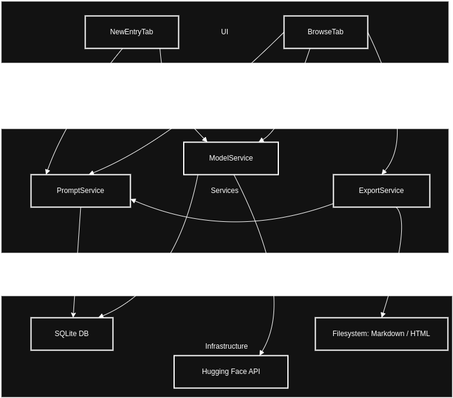

# 🧠 AI Reply Index App

[](https://www.python.org/)
[](https://riverbankcomputing.com/software/pyqt/)
[](https://www.sqlite.org/index.html)
[](https://daringfireball.net/projects/markdown/)

---

## 🚀 About the App

This is the **AI Reply Index desktop application**, a local GUI tool built with PyQt5 that helps you record, organize, and manage prompt-response interactions with AI models like ChatGPT, Claude, Gemini, and open-source LLMs.

It's the companion tool for the main [`ai-reply-index`](../README.md) repository — designed to streamline contributions and keep formatting consistent.

---

## 📦 Features

- 📝 Create prompt-response entries with a clean editor
- 🧠 Compare different model outputs side-by-side
- 📂 Categorize prompts with tags and folders
- 🧲 Automatically fetch and cache model registries (Hugging Face, Open Source)
- 🧾 Full metadata capture (timestamp, model, tags)
- 📄 Auto-converts DOCX input to Markdown
- 🔍 Full-text search across stored responses
- 🌐 Export prompt sets to static HTML site

---

## 🛠️ Installation

### Using Poetry
```bash
poetry install
poetry run python app/main.py
```

---

## 🧪 App Architecture

- **ModelService**: Dynamically loads and updates the model registry (open and commercial)
- **PromptService**: Manages prompt creation, validation, and saving to DB
- **ExportService**: Converts prompt-response folders into static HTML
- **DBManager**: Lightweight SQLite interface for indexing and searching entries

---

## 🖥️ App Layout

- **New Entry Tab**: Input your prompt, response, and select model. Adds metadata + saves all files.
- **Browse/Edit Tab**: Search, filter, and edit existing entries (with full-text search).
- **Compare Tab**: Compare responses from multiple models to the same prompt.

---

## 📁 Output Format

Each saved entry is stored under `/prompts/` in the following format:

```
prompts/YYYY-MM-DD_slug/
├── prompt.md
├── GPT-4.md
├── Claude.md
└── metadata.json
```

---

## 🧹 Formatting Tools

The app uses:
- `mdformat` + `mdformat-ruff`: To clean and lint Markdown files
- `docx2md`: To convert DOCX to Markdown

These are integrated into the save pipeline to keep file consistency.

---

## 🔄 Export Static Site (Optional)

To export all entries to a static HTML archive:
```bash
python scripts/export_static_site.py
```
HTML files will be generated under the `dist/` directory.

---

### 🔄 Workflow



---

## 📬 Contributing

Please use the app to prepare your contributions. See the [main README](../README.md) and [CONTRIBUTING.md](../CONTRIBUTING.md) for full contributor guidelines.

---

## 🪪 License

MIT © [@sandy-sp](https://github.com/sandy-sp)

---

> _This app is your companion for structured, searchable, and shareable prompt benchmarking. Use it to fuel collaborative AI insight._

